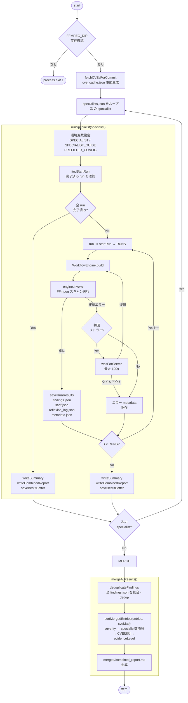

# SourceHunt

LLM を使って FFmpeg のソースコードから脆弱性を自律的に発見するブラインドテストパイプライン。  
**ターゲット**: CVE-2022-2566 / `libavformat/mov.c` / FFmpeg commit `ced0dc807e`

---

## 研究背景

Anthropic が開発した **[Claude Mythos Preview](https://red.anthropic.com/2026/mythos-preview/)**（コードネーム Capybara）は全主要 OS・ブラウザのゼロデイ脆弱性を自律的に発見できる。危険性から一般公開を見送り、重要インフラ限定の早期アクセスプログラム **[Project Glasswing](https://www.anthropic.com/glasswing)** として提供している（CyberGym CVR: 83.1%）。

Lazarus AI の **[Clearwing](https://github.com/Lazarus-AI/clearwing)** はその OSS 再実装だが、Reflexion ループが未実装。本プロジェクトはその欠落を TypeScript（LangGraph）で補い、Clearwing を超える脆弱性スキャンワークフローを構築することを目的とする。

[Project Glasswing](https://www.anthropic.com/glasswing) のワークフローが示す本質は「モデルではなく設計にある」。4 ステップ（分析 → 並列実行 → Fact-Based 検証 → 再確認）はモデルを差し替えても機能する。

[Clearwing](https://github.com/Lazarus-AI/clearwing) は LangGraph ライクな独自ライブラリ（`NativeAgentGraph`）を使用しており、LangGraph JS のミドルウェアである SceneGraphManager で再現可能と判断した。

---

## アーキテクチャ

`sourcehunt.json`（OpenAgentJson フォーマット）で定義された 6 つの **ノード**が  
SceneGraphManager / LangGraph JS 上で実行される。  
各ノードは `AsyncFunction` で実行される JavaScript コードであり、LLM 呼び出しをコード内に埋め込む。

```
sourcehunt.json（OpenAgentJson）
│
├─ ranker_node ─── LLM × 3チャンク でファイルをスコアリング
│       ↓ top 5 を選択
├─ hunter_node × 5 ─── Fan-out 並列スキャン
│       ↓ Fan-in
├─ verifier_node ─── 発見内容を検証
│       ├─ [失敗あり & 再試行上限未達]
│       │       ↓
│       │  failure_analyst_node ── verbal gradient 生成  ← Clearwing 未実装
│       │       ↓ Fan-out（再試行）
│       │  hunter_node × M（gradient 注入済み）→ verifier_node
│       │
│       └─ [全成功 or MAX_REFLEXION 到達]
│               ↓
├─ exploiter_node ─── PoC 生成
└─ reporter_node ──── レポート生成 → END
```

**モデル**: unsloth/Qwen3.6-35B-A3B（llama.cpp, `http://localhost:8001`）  
**VRAM**: RTX 3090 24GB / `--parallel 3` + `TOP_N=5` で安定動作

---

## テスト環境

Claude Code がテストの起動・監視・報告を担い、SceneGraphManager アプリケーションがバックグラウンドで実行される。  
ワークフローは `sourcehunt.json`（OpenAgentJson フォーマット）で定義された 6 ノードで構成され、  
各ノードは FFmpeg リポジトリへのファイルアクセスと llama-server への LLM 呼び出しを組み合わせてスキャンを行う。

```
 ┌─────────────────────────────────────────────────────────────────────┐
 │                   Claude Code（AI アシスタント）                       │
 │                                                                     │
 │  ┌──────────────────────────────┐  ┌───────────────────────────┐   │
 │  │  Monitor tool                │  │  Bash tool                │   │
 │  │  tail -f run_output.log      │  │  grep / ps / ls           │   │
 │  │  grep: detected= / done in   │  │  進捗確認・ファイル検証    │   │
 │  │  → イベント通知（リアルタイム）│  │  → 経過報告 / 最終報告    │   │
 │  └──────────────────────────────┘  └───────────────────────────┘   │
 └──────────────────────────────┬──────────────────────────────────────┘
                                │ observe（stdout をリアルタイム監視）
 ┌──────────────────────────────▼──────────────────────────────────────┐
 │              run.ts（テストランナー）                                  │
 │                                                                     │
 │  FFMPEG_DIR=.../ffmpeg-vuln nohup tsx run.ts >> run_output.log &    │
 │                                                                     │
 │  specialists.json を読み込み 3 specialist × 5 runs を直列実行         │
 │  SPECIALIST_GUIDE / PREFILTER_CONFIG を環境変数でノードに注入          │
 └──────────────────────────────┬──────────────────────────────────────┘
                                │ WorkflowEngine.invoke()
 ┌──────────────────────────────▼──────────────────────────────────────┐
 │         SceneGraphManager / WorkflowEngine（LangGraph）              │
 │                                                                     │
 │  ┌─────────────────────────────────────────────────────────────┐   │
 │  │            sourcehunt.json（OpenAgentJson フォーマット）       │   │
 │  │                                                             │   │
 │  │  { "nodes": [                                               │   │
 │  │      { "id": "ranker_node",     "type": "function", … },   │   │
 │  │      { "id": "hunter_node",     "type": "function", … },   │   │
 │  │      { "id": "verifier_node",   "type": "function", … },   │   │
 │  │      { "id": "failure_analyst", "type": "function", … },   │   │
 │  │      { "id": "exploiter_node",  "type": "function", … },   │   │
 │  │      { "id": "reporter_node",   "type": "function", … }    │   │
 │  │    ],                                                       │   │
 │  │    "edges": [ conditional / Send API / Fan-out … ]          │   │
 │  │  }                                                          │   │
 │  └─────────────────────────────────────────────────────────────┘   │
 └──────────────────────────────┬──────────────────────────────────────┘
                                │ ノード実行（エージェント）
 ┌──────────────────────────────▼──────────────────────────────────────┐
 │                       エージェント（各ノード）                         │
 │                                                                     │
 │  ranker_node              hunter_node × 5        verifier_node      │
 │  ┌─────────────────┐      ┌─────────────────┐    ┌──────────────┐  │
 │  │[SKILL] FS 読込  │      │[SKILL] FS 読込  │    │[SKILL] LLM   │  │
 │  │ statSync()      │      │ readFileSync()  │    │ verify()     │  │
 │  │ → ファイルサイズ │ ×5   │ → .c ソース     │    │ PASS / FAIL  │  │
 │  │[SKILL] LLM 呼出 │      │[SKILL] LLM 呼出 │    └──────┬───────┘  │
 │  │ rank 142 files  │      │ hunt vulns      │           │ Reflexion │
 │  │ → top 5 選出    │      │ → findings      │    failure_analyst    │
 │  └────────┬────────┘      └────────┬────────┘    ┌──────────────┐  │
 │           │  Fan-out（Send API）    │  Fan-in      │[SKILL] LLM   │  │
 │           └────────────────────────┘              │ verbal grad  │  │
 └─────────────────────────┬────────────────────┬────┴──────────────┘──┘
           [SKILL] LLM 呼出 │                    │ [SKILL] FS 読込
 ┌─────────────────────────▼──┐  ┌──────────────▼──────────────────────┐
 │  llama-server :8001         │  │  FFmpeg Repository（ffmpeg-vuln/）    │
 │  Qwen3.6-35B-A3B Q4_K_M    │  │                                     │
 │  RTX 3090 24GB              │  │  libavformat/mov.c        313KB      │
 │                             │  │  libavcodec/h264_slice.c            │
 │  ┌─────────────────────┐   │  │  libavcodec/hevcdec.c    ...        │
 │  │KV cache × 3 slot    │   │  │  2537 .c files（スキャン対象）       │
 │  │（--parallel 3）      │   │  │                                     │
 │  │ TOP_N=5 の Fan-out  │   │  │  commit: ced0dc807e                  │
 │  │ → 3 同時+2 キュー   │   │  │  （CVE-2022-2566 脆弱なコミット）     │
 │  └─────────────────────┘   │  └─────────────────────────────────────┘
 └─────────────────────────────┘
```

| レイヤー            | コンポーネント                     | 役割                                                        |
|-----------------|-----------------------------|-------------------------------------------------------------|
| Claude Code     | Monitor / Bash tool         | ログ監視・プロセス確認・経過報告・最終報告                           |
| テストランナー         | `run.ts`                    | specialist ループ・環境変数注入・結果保存                        |
| ワークフローエンジン      | SceneGraphManager           | OpenAgentJson を解析しグラフを構築・実行                           |
| ノード定義         | `sourcehunt.json`           | 6 ノードを OpenAgentJson フォーマットで記述                            |
| SKILL: FS アクセス  | `statSync` / `readFileSync` | ファイルサイズ取得・ソースコード読み込み                                    |
| SKILL: LLM 呼出 | LlamaCpp Factory            | ranker / hunter / verifier / analyst / exploiter / reporter |
| LLM バックエンド      | llama-server :8001          | `--parallel 3` で Fan-out × 5 を処理                          |
| スキャン対象        | ffmpeg-vuln/                | 2537 .c ファイル（脆弱なコミット `ced0dc807e`）                        |

---

## run.ts フローチャート

`FFMPEG_DIR` 確認と CVE キャッシュ生成を済ませたあと、`specialists.json` に定義された specialist を直列にループする。  
各 specialist は `runSpecialist()` で 5 run を実行し（完了済み run は `metadata.json` の有無で自動スキップ）、  
全 specialist 完了後に `mergeAllResults()` で findings を統合して `merged/combined_report.md` を生成する。



---

## llama.cpp サーバー設定

Qwen3.6-35B-A3B（Q4_K_M）を RTX 3090 でローカル実行する LLM バックエンド。  
OpenAI 互換 API（`:8001`）を公開し、SceneGraphManager の LlamaCpp ファクトリ経由で全ノードから呼び出される。  
`--parallel` と `TOP_N` の組み合わせが VRAM 安定動作の鍵であり、Fan-out 数はサーバーの同時処理スロット数に合わせて調整する。

### PC 構成

| 項目          | 値                                     |
|---------------|----------------------------------------|
| GPU           | NVIDIA GeForce RTX 3090（24GB, sm_86）   |
| CPU           | AMD Zen4                               |
| RAM           | 64GB                                   |
| OS            | Ubuntu 26.04 LTS                       |
| NVIDIA Driver | 595.58.03                              |
| CUDA Toolkit  | 13.1.115                               |
| llama.cpp     | v9031                                  |
| Model         | Qwen3.6-35B-A3B-UD-Q4_K_M.gguf（21GB）   |
| 推論速度      | 約 133 token/s（`--cache-reuse` 有効時） |

### 起動

```bash
bash ~/Desktop/Work/run_qwen.sh > /tmp/qwen_server.log 2>&1 &
curl http://localhost:8001/health   # → {"status":"ok"} が返れば準備完了
```

クラッシュ時の自動再起動付き監視スクリプト。モデルロードに 10〜30 秒かかる。

### サーバーパラメータ

```bash
llama-server \
    --model Qwen3.6-35B-A3B-UD-Q4_K_M.gguf \
    --alias "unsloth/Qwen3.6-35B-A3B" \
    -ngl 41 --flash-attn on \
    --ctx-size 204800 \
    --cache-type-k q8_0 --cache-type-v q8_0 \
    --cache-reuse 512 --cache-idle-slots \
    --kv-unified \
    --parallel 3 \          # ← Fan-out 数と連動（後述）
    --port 8001
```

| パラメータ               | 値        | 意味                               |
|---------------------|-----------|------------------------------------|
| `-ngl 41`           | 41 層     | 全層を GPU オフロード                    |
| `--ctx-size`        | 204800    | コンテキスト長（~150k トークン）               |
| `--flash-attn on`   | 有効      | FlashAttention による高速化・VRAM 削減 |

> **現在の設定**
>
> 上記パラメータ（`--ctx-size 204800`）が現在適用されている。
> `--cache-idle-slots` は OOM 対策で削除済み。
>
> | 状態 | VRAM |
> |---|---|
> | アイドル | 24054 MiB |
> | 会話 x2 | 24058 MiB |
> | 9000トークン | 24060 MiB |
> | OOM エラー | 0 |
>
> OOM 対策済みで sourcehunt テストも問題なく動作する。
| `--cache-type-k/v`  | q8_0      | KV キャッシュを Q8 量子化（VRAM 削減）     |
| `--cache-reuse 512` | 512 token | 同一プロンプトの KV キャッシュ再利用          |
| `--parallel`        | **3**     | 同時処理スロット数（VRAM と要トレードオフ）     |

### Fan-out / Fan-in と `--parallel` / `TOP_N` の関係

hunter_node は `Send API` で `TOP_N` 件のファイルを**同時に**スキャンする（Fan-out）。  
llama.cpp の `--parallel N` はサーバーが同時に処理できるリクエスト数の上限。  
**この 2 つのパラメータのバランスが VRAM 安定動作の鍵。**

```
TOP_N=5  (sourcehunt.json / prefilter.json)
  ↓ hunter_node が 5 リクエストを同時送信
llama-server --parallel 3
  ↓ 3 スロットで即時処理 + 2 リクエストはキュー待ち
  ↓ 順次処理（VRAM スパイクなし）
```

VRAM の消費式：

```
VRAM ≒ モデルウェイト + ctx-size × parallel × KV幅(q8_0=1byte/token)
     = ~22GB (Q4_K_M) + 204800 × 3 × 2 × 1B ≒ 23.2GB  ← RTX 3090 24GB でギリギリ安全
```

**`--parallel` を増やすとどうなるか**

| `--parallel` | 同時処理     | VRAM 増加 | 推奨 `TOP_N`       |
|--------------|--------------|-----------|--------------------|
| 1            | 完全直列     | 最小      | ≤ 5（安全）          |
| 3            | 3 並列 + キュー | +1.2GB    | **5（動作確認済み）** |
| 5            | 5 並列 + キュー | +2.0GB    | ≤ 8                |
| 10           | 10 並列      | +4.0GB    | OOM（クラッシュ実績あり）   |

> `--parallel` を増やす場合は `--ctx-size` を下げるか GPU メモリ増設が必要。

**Reflexion リトライ時の注意**

failure_analyst_node が再試行対象を選定すると hunter_node が再度 Fan-out する。  
最大 `MAX_REFLEXION × TOP_N` リクエストが連続して発行されるため、  
`--parallel 3` のキューが詰まっても順次処理されるだけで OOM にはならない。

### temperature の優先順位

サーバー側の `--temp 0.6` はクライアントが `temperature` を送信しない場合のデフォルト値。  
`sourcehunt.json` でノードごとに `temperature` を指定した場合はクライアント側が優先される。

| ノード                  | temperature | 意図                   |
|----------------------|-------------|------------------------|
| ranker               | 0.1         | 決定論的スコアリング         |
| hunter               | 0.3         | 脆弱性推論に適度な創造性 |
| verifier             | 0.1         | 判定精度重視           |
| failure_analyst      | 0.5         | 仮説修正に創造性        |
| exploiter / reporter | 0.2         | 正確な出力形式          |

### ワークフロー JSON での指定

```json
{
  "models": [
    {
      "id": "ranker",
      "type": "LlamaCpp",
      "config": {
        "model": "unsloth/Qwen3.6-35B-A3B",
        "serverUrl": "http://localhost:8001",
        "temperature": 0.1
      }
    }
  ]
}
```

---

## Ranker プレフィルター

LLM に渡す候補ファイルを 2537 件から絞り込む前処理。  
キーワードマッチによる heuristic スコアリングは意味的バイアスを内包し `libavformat/mov.c` を候補から除外していたため廃止。  
代替としてディレクトリ単位のサブシステム比例クォータを採用し、クォータ内はファイルサイズ降順で選択することでバイアスのない 142 件を確保する。設定は `prefilter.json` で管理しコード変更不要。

### 設計（`prefilter.json`）

heuristic スコアリングを廃止し、サブシステム比例クォータに置き換え。

```json
{
  "chunkSize": 50,
  "topN": 5,
  "subsystems": [
    { "dir": "libavcodec",  "quota": 82 },
    { "dir": "libavformat", "quota": 40 },
    { "dir": "libavfilter", "quota": 20 },
    { "dir": "*",           "quota": 8  }
  ]
}
```

### 改善経緯

| 項目                  | 旧 heuristic              | 新クォータ方式                     |
|-----------------------|---------------------------|--------------------------------|
| `mov.c` が候補に入る確率 | ほぼ 0%（スコア=0、rank 401/544） | 高（libavformat 上位 40 件に入る） |
| バイアスの種類             | キーワードマッチによる意味的バイアス     | なし（ファイルサイズ降順・中立）           |
| チューニング                | コード変更                   | `prefilter.json` 編集のみ        |

---

## Multi-Specialist

3 つの Specialist を直列実行し、最後に全 findings をマージして統合レポートを生成する。

```
specialists.json（外部定義）
    ↓
run.ts
    ├── memory_safety    × 5 runs → results/memory_safety/
    ├── input_validation × 5 runs → results/input_validation/
    ├── integer_overflow × 5 runs → results/integer_overflow/
    └── 全完了後 → results/merged/combined_report.md
```

### specialists.json

各 specialist の名前・観点・hunter_node へ注入するガイド文字列を定義する外部設定ファイル。  
`run.ts` はこのファイルを読み込み、`SPECIALIST_GUIDE` 環境変数を通じて hunter_node にガイドを渡す。

```json
[
  {
    "name": "memory_safety",
    "description": "OOB・バッファオーバーフロー・UAF",
    "guide": "Focus on: buffer overflows, use-after-free, double-free, integer overflows, out-of-bounds reads/writes, format string vulnerabilities."
  },
  {
    "name": "input_validation",
    "description": "境界チェック前アクセス・負インデックス・サイズ未検証",
    "guide": "Focus on: missing bounds checks before array/pointer access, unchecked negative indices, missing NULL checks before dereference, unvalidated size parameters passed to allocators, unchecked return values of functions that can fail, use of untrusted values before range validation."
  },
  {
    "name": "integer_overflow",
    "description": "算術オーバーフロー・sentinel 衝突・符号変換",
    "guide": "Focus on: uncapped integer counters that can wrap around and collide with sentinel values (e.g. 0xFFFF, 0xFF), signed/unsigned integer conversion bugs, arithmetic overflow in allocation size calculations (e.g. a*b before malloc), 32-bit truncation of 64-bit accumulations, shift operations exceeding type width."
  }
]
```

| フィールド         | 用途                                                           |
|---------------|----------------------------------------------------------------|
| `name`        | 結果ディレクトリ名・ログ識別子・`SPECIALIST` 環境変数の値                 |
| `description` | 人間向けの観点サマリー（ログ出力のみ）                                     |
| `guide`       | hunter_node のプロンプトに注入するスキャン方針（`SPECIALIST_GUIDE` 環境変数） |

新しい specialist の追加は `specialists.json` へのエントリ追加のみ（コード変更不要）。

---

## テスト結果（CVE-2022-2566 / FFmpeg ブラインドテスト）

3 specialist × 5 run（計 15 run）を実施。ターゲットは `libavformat/mov.c` の heap OOB write（CVE-2022-2566）。

**総評**: memory_safety・input_validation は 5/5 で完全検出。integer_overflow は LLM ランキングの確率的揺れにより 2/5 の PARTIAL となったが、マージ後の統合レポートには `mov.c` の finding が確実に含まれており**システム全体としては目的を達成**。Ranker プレフィルター改善（heuristic 廃止）が直接の要因で、改善前は全 15 run で検出率 0% だった。また副産物として `h264_slice.c`・`hevcdec.c`・`vp9.c` など `mov.c` 以外にも複数の未報告脆弱性候補を発見した。

### 検出率

| Specialist       | 検出率          | verdict | 平均時間 | 平均 Reflexion |
|------------------|-----------------|---------|----------|----------------|
| memory_safety    | **5/5 (100%)**  | PASS    | 26.6 min | 7.4 回         |
| input_validation | **5/5 (100%)**  | PASS    | 24.7 min | 7.2 回         |
| integer_overflow | **2/5 (40%)**   | PARTIAL | 37.8 min | 13.4 回        |
| **合計**         | **12/15 (80%)** | —       | —        | —              |

`integer_overflow` の PARTIAL は `mov.c` が top-5 に入らない run が 3/5 あったため。  
ただし `memory_safety` と `input_validation` が 10/10 で補完しており、マージ後レポートには `mov.c` の finding が確実に含まれる。

### マージ結果（`results/merged/combined_report.md`）

| 項目            | 値                                 |
|-----------------|------------------------------------|
| Unique findings | 136 件                             |
| Critical        | 14 件                              |
| High            | 91 件                              |
| Medium          | 29 件                              |
| Low             | 2 件                               |
| CVE マッチ         | OSV.dev 登録 71 件中 **54 件発見** |

findings のソート順: **severity → specialist 数降順 → CVE 既知 → evidence level**

### 注目 findings（multi-specialist 検出 + CVE 既知）

| 優先度 | ファイル                          | 種別                   | CVE                            |
|--------|-------------------------------|------------------------|--------------------------------|
| 🔴×2   | `libavcodec/hevcdec.c:163`    | out_of_bounds_write    | CVE-2019-11338, CVE-2024-32228 |
| 🔴×2   | `libavcodec/h264_slice.c:145` | integer_overflow       | —                              |
| 🔴×3   | `libavcodec/hevcdec.c:93`     | integer_overflow（HIGH） | CVE-2019-11338, CVE-2024-32228 |
| 🔴×2   | `libavformat/mov.c:192`       | buffer_overflow（HIGH）  | CVE-2016-3062, CVE-2025-1373   |

---

## ユニットテスト

```bash
yarn jest works/sourcehunt/__tests__/sourcehunt.test.ts \
  --config works/sourcehunt/jest.config.js
```

**29 tests, 全 PASS**

| テスト対象                                 | 件数 |
|-----------------------------------------|------|
| `loadSpecialists()`                     | 5    |
| `filterSpecialists()`                   | 3    |
| `deduplicateFindings()`                 | 6    |
| `sortMergedEntries()`（CVE-aware ソート含む） | 9    |
| `findStartRun()` / Resume ロジック          | 5    |
| `SEVERITY_ORDER` 定数                   | 1    |

`sortMergedEntries` は `cveMap` オプション引数を取り、CVE 既知を specialist 数の次の優先基準として使用する。

---

## クイックスタート

実際のテストでは、ユーザーは「**テストを実行**」と指示しただけで以下のすべてを Claude Code が自律的に実施した。

**所要時間**: 約 7 時間 25 分（全 15 run 合計）

```
┌──────────┬─────────────────────────┐
│   項目   │           値            │
├──────────┼─────────────────────────┤
│ GPU      │ RTX 3090（24GB, sm_86） │
├──────────┼─────────────────────────┤
│ CPU      │ AMD Zen4                │
├──────────┼─────────────────────────┤
│ RAM      │ 64GB                    │
├──────────┼─────────────────────────┤
│ OS       │ Ubuntu 26.04 LTS        │
├──────────┼─────────────────────────┤
│ Model    │ Q4_K_M 21GB             │
├──────────┼─────────────────────────┤
│ 推論速度 │ 約 133 token/s          │
└──────────┴─────────────────────────┘
```

| Specialist       | 合計時間                    | 平均 / run |
|------------------|-----------------------------|------------|
| memory_safety    | 約 133 分                   | 約 26.6 分 |
| input_validation | 約 124 分                   | 約 24.7 分 |
| integer_overflow | 約 189 分                   | 約 37.8 分 |
| **合計**         | **約 446 分（7 時間 25 分）** | 約 29.7 分 |

`integer_overflow` の平均が長いのは Reflexion リトライ回数が多かったため（平均 13.4 回 vs memory_safety 7.4 回）。


- `nohup` でテストをバックグラウンド起動
- Monitor tool で `run_output.log` をリアルタイム監視し、`detected=` / `done in` を検知して経過報告
- `grep` / `ls` でファイルの生成状況・完了 run 数を随時確認
- 全 specialist 完了後に検出率・findings サマリー・注目 CVE を最終報告
- `combined_report.md` の内容確認・ソート（severity → specialist 数 → CVE 既知）も Claude Code が実施

```bash
# llama.cpp サーバー確認
curl http://localhost:8001/health   # → {"status":"ok"}

# 全 specialist を直列実行（バックグラウンド）
FFMPEG_DIR=/home/akudo/Desktop/Work/ffmpeg-vuln \
  nohup node_modules/.bin/tsx works/sourcehunt/run.ts \
  >> works/sourcehunt/results/run_output.log 2>&1 &

# 単一 specialist のみ（デバッグ用）
SPECIALIST=memory_safety \
FFMPEG_DIR=/home/akudo/Desktop/Work/ffmpeg-vuln \
  node_modules/.bin/tsx works/sourcehunt/run.ts

# 進捗確認
tail -f works/sourcehunt/results/run_output.log
grep "done in" works/sourcehunt/results/run_output.log
```

**中断・再開**: 同じコマンドを再実行するだけで `metadata.json` が存在する run を自動スキップ。

---

## ファイル構成

```
works/sourcehunt/
├── run.ts                 ← メインランナー（全 specialist 直列実行）
├── sourcehunt.json        ← SGM ワークフロー定義（全ノード実装済み）
├── sourcehunt.lib.ts      ← テスト可能な純粋関数・型定義
├── specialists.json       ← Specialist 定義（3 specialist）
├── prefilter.json         ← Ranker クォータ設定
├── __tests__/
│   └── sourcehunt.test.ts ← ユニットテスト（29 件）
└── results/               ← テスト結果（git 管理外）
    ├── run_output.log
    ├── memory_safety/
    ├── input_validation/
    ├── integer_overflow/
    └── merged/
        └── combined_report.md
```

---

## 参照ドキュメント

| ドキュメント                                                                                                    | 内容                                                   |
|-----------------------------------------------------------------------------------------------------------|--------------------------------------------------------|
| [plans/sourcehunt/research/README.md](../../plans/sourcehunt/research/README.md)                            | Claude Mythos / Project Glasswing / Clearwing 調査レポート |
| [plans/sourcehunt/base/README.md](../../plans/sourcehunt/base/README.md)                                    | Phase 1〜5 実装ガイド・VRAM 設計・Resume 仕様                |
| [plans/sourcehunt/multi-specialist/README.md](../../plans/sourcehunt/multi-specialist/README.md)            | Multi-Specialist 実装仕様・Ranker 改善詳細              |
| [plans/sourcehunt/README.md](../../plans/sourcehunt/README.md)                                              | CVE マッチング仕様・インデックス                                   |
| [plans/llamacpp/README.md](../../plans/llamacpp/README.md)                                                  | llama.cpp ファクトリ実装・サーバー設定詳細                       |
| [Brainstorming/research/llama-cpp-gpu/README.md](../../../Brainstorming/research/llama-cpp-gpu/README.md) | PC 構成・RTX 3090 推論環境・パフォーマンス実測値                |
